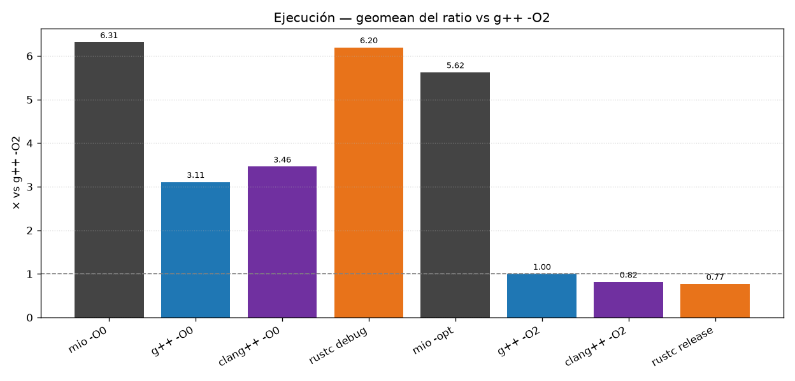
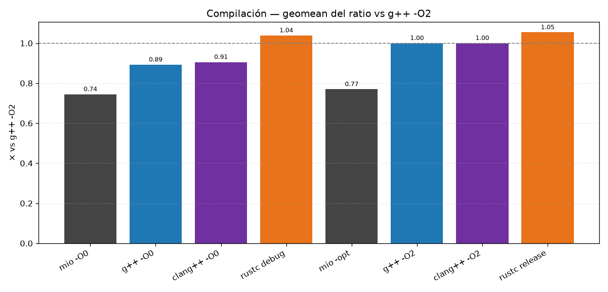
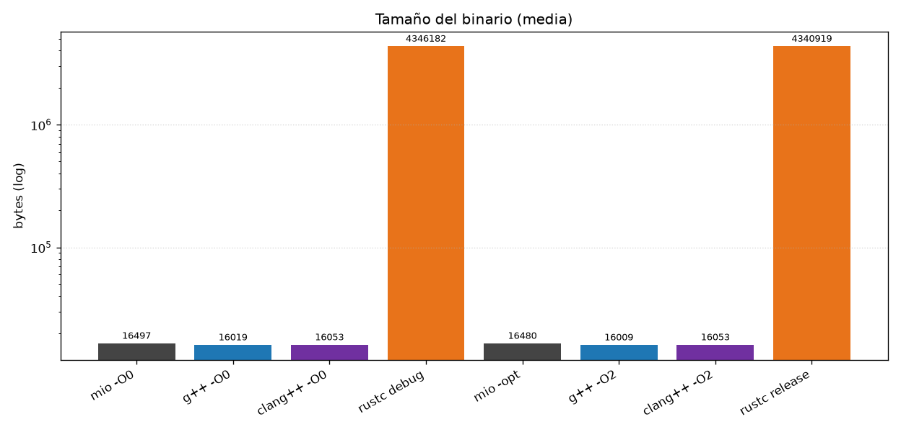

# Benchmarks y Evaluación Comparativa

Evaluación cuantitativa del compilador `mio` frente a los toolchains comerciales GCC y
Clang/LLVM. Se miden tres ejes —tiempo de ejecución, tiempo de compilación y tamaño de
binario— sobre un conjunto de ocho programas diseñados para ejercitar distintos patrones
de cómputo. Los resultados se obtuvieron en un entorno Linux nativo controlado y se
analizan desde la perspectiva de la ingeniería de compiladores, justificando las
diferencias observadas a partir del código máquina generado por cada toolchain.

---

## 1. Metodología y Entorno de Pruebas

### 1.1 Entorno de Medición

Las pruebas se ejecutaron sobre una máquina con procesador x86-64 y memoria RAM estándar,
corriendo un sistema operativo **Linux nativo** (kernel sin virtualización). La elección
de Linux nativo —frente a alternativas como WSL o Windows— responde a dos factores
técnicos:

- **Reducción de ruido en las mediciones.** WSL 2 ejecuta un kernel Linux dentro de una
  VM ligera de Hyper-V; las llamadas al sistema, la planificación de procesos y el acceso
  a memoria atraviesan capas de virtualización que introducen variabilidad no
  determinista. En Linux nativo, el proceso de benchmark tiene acceso directo al
  scheduler del kernel y a la jerarquía de caché sin intermediarios.
- **Consistencia del toolchain.** Los binarios de GCC y Clang se enlazan contra la glibc
  nativa del sistema, eliminando posibles discrepancias de ABI o de versión de runtime
  que pueden aparecer en entornos cruzados.

### 1.2 Métricas

| Métrica | Descripción | Unidad |
|---|---|---|
| **Tiempo de ejecución** | Mediana de N iteraciones CPU-bound del programa compilado. | ms |
| **Tamaño de binario** | Tamaño del ejecutable ELF enlazado. | bytes |
| **Tiempo de compilación** | Tiempo desde la invocación del compilador hasta la generación del ejecutable final. | ms |

### 1.3 Toolchains Comparados

Se evalúan seis configuraciones que cubren el espectro desde desarrollo sin optimizar
hasta producción optimizada:

| Toolchain | Flag | Descripción |
|---|---|---|
| `mio -O0` | `-O0` (implícito) | Compilador propio, sin optimizaciones. Genera assembly directamente desde el AST. |
| `mio -opt` | `--opt` | Compilador propio con optimizaciones a nivel de AST habilitadas (constant folding, constant propagation, algebraic simplification, dead code elimination). |
| `g++ -O0` | `-O0` | GCC sin optimizaciones. Aún aplica asignación local de registros y representación SSA interna. |
| `g++ -O2` | `-O2` | GCC con optimizaciones de producción (inlining, loop unrolling, vectorización, scheduling). |
| `clang++ -O0` | `-O0` | Clang/LLVM sin optimizaciones. El frontend emite LLVM IR sin pasos de optimización. |
| `clang++ -O2` | `-O2` | Clang/LLVM con optimizaciones de producción (pipeline completo de pases LLVM). |

---

## 2. Conjunto de Pruebas (Benchmarks)

Los ocho programas de prueba fueron seleccionados para cubrir distintos ejes de estrés
computacional: recursión profunda, iteración intensiva, aritmética de punto flotante,
acceso a arreglos y oportunidades de simplificación estática.

| Benchmark | Patrón ejercitado | Descripción |
|---|---|---|
| **`fib`** | Recursión exponencial | Fibonacci recursivo naïve (`fib(40)`). Genera ~2×10⁹ llamadas recursivas; estresa el overhead de prólogo/epílogo y el manejo de stack frames. |
| **`collatz`** | Loops + condicionales + enteros | Calcula la longitud acumulada de la secuencia de Collatz para los primeros 10⁶ enteros. Combina `while`, `if/else`, división y módulo en un loop anidado intensivo. |
| **`sort`** | Loops anidados + acceso a arreglos estáticos | Bubble sort sobre un arreglo estático de 10 000 elementos. Patrón O(n²) que estresa el acceso indexado a arreglos en el stack frame. |
| **`sieve`** | Loops + arreglos dinámicos | Criba de Eratóstenes hasta 10⁶. Acceso secuencial y disperso a un arreglo dinámico (`new int[n]`); patrón dominado por loads/stores a memoria. |
| **`series_pi`** | Loop + aritmética flotante | Aproximación de π mediante la serie de Leibniz con 10⁷ términos. Estresa la emisión de instrucciones `addsd`, `divsd` y el manejo de operandos `%xmm`. |
| **`mandelbrot`** | Loops anidados + flotantes intensivos | Cálculo del conjunto de Mandelbrot en una grilla de 600×600 con hasta 256 iteraciones por píxel. Combina aritmética flotante con control de flujo complejo (`while` con condición compuesta `&&`). |
| **`quicksort`** | Recursión + punteros + arreglos dinámicos | Quicksort in-place sobre 10⁶ elementos en heap. Combina recursión, paso de punteros, aritmética de punteros e intercambio de elementos vía indexación. |
| **`opt_heavy`** | Simplificación algebraica + dead code | Loop de 10⁸ iteraciones con variables constantes (`a=1, b=0, c=1, d=0`), expresiones algebraicamente reducibles (`i*1+0`) y ramas muertas (`if (1==0)`). Diseñado específicamente para medir el impacto de las optimizaciones de AST de `mio`. |

---

## 3. Resultados Experimentales

### 3.1 Gráficos Resumen







### 3.2 Tablas de Resultados

#### Resumen General

Tamaño = media aritmética; tiempos = media geométrica del ratio vs `g++ -O2`.

| Toolchain | Tamaño medio (bytes) | Ejecución (×) | Compilación (×) |
|---|---|---|---|
| mio -O0 | 16550 | 6.26 | 0.73 |
| g++ -O0 | 16001 | 3.19 | 0.88 |
| clang++ -O0 | 15933 | 3.65 | 1.09 |
| mio -opt | 16533 | 5.74 | 0.77 |
| g++ -O2 | 15981 | 1.00 | 1.00 |
| clang++ -O2 | 15933 | 0.82 | 1.22 |

#### Tiempo de Compilación (ms)

**Sin optimización:**

| Benchmark | mio -O0 | g++ -O0 | clang++ -O0 |
|---|---|---|---|
| collatz | 117.9 | 102.0 | 130.5 |
| fib | 75.3 | 107.4 | 132.3 |
| mandelbrot | 89.9 | 105.8 | 122.9 |
| opt_heavy | 78.4 | 110.4 | 128.6 |
| quicksort | 86.0 | 98.1 | 122.2 |
| series_pi | 80.2 | 93.4 | 120.8 |
| sieve | 75.9 | 97.4 | 114.0 |
| sort | 76.5 | 99.6 | 138.5 |

**Con optimización:**

| Benchmark | mio -opt | g++ -O2 | clang++ -O2 |
|---|---|---|---|
| collatz | 133.9 | 115.7 | 132.8 |
| fib | 92.8 | 143.3 | 138.2 |
| mandelbrot | 81.6 | 113.2 | 139.5 |
| opt_heavy | 78.2 | 104.6 | 135.4 |
| quicksort | 85.2 | 121.5 | 141.1 |
| series_pi | 83.4 | 99.4 | 127.4 |
| sieve | 77.2 | 116.0 | 129.6 |
| sort | 89.7 | 119.2 | 194.7 |

#### Tamaño del Binario (bytes)

**Sin optimización:**

| Benchmark | mio -O0 | g++ -O0 | clang++ -O0 |
|---|---|---|---|
| collatz | 16432 | 15944 | 15896 |
| fib | 16288 | 15968 | 15920 |
| mandelbrot | 16752 | 15944 | 15896 |
| opt_heavy | 16432 | 15944 | 15896 |
| quicksort | 16728 | 16168 | 16040 |
| series_pi | 16432 | 15944 | 15896 |
| sieve | 16704 | 16120 | 15992 |
| sort | 16632 | 15976 | 15928 |

**Con optimización:**

| Benchmark | mio -opt | g++ -O2 | clang++ -O2 |
|---|---|---|---|
| collatz | 16432 | 15944 | 15896 |
| fib | 16288 | 15968 | 15920 |
| mandelbrot | 16752 | 15944 | 15896 |
| opt_heavy | 16296 | 15944 | 15896 |
| quicksort | 16728 | 16088 | 16040 |
| series_pi | 16432 | 15944 | 15896 |
| sieve | 16704 | 16040 | 15992 |
| sort | 16632 | 15976 | 15928 |

#### Tiempo de Ejecución (ms)

**Sin optimización:**

| Benchmark | mio -O0 | g++ -O0 | clang++ -O0 |
|---|---|---|---|
| collatz | 898.6 | 339.7 | 592.2 |
| fib | 642.9 | 508.7 | 482.5 |
| mandelbrot | 430.7 | 145.4 | 154.6 |
| opt_heavy | 371.9 | 154.2 | 220.3 |
| quicksort | 143.4 | 101.3 | 97.0 |
| series_pi | 110.6 | 31.0 | 41.8 |
| sieve | 15.2 | 14.2 | 13.0 |
| sort | 148.3 | 87.1 | 86.7 |

**Con optimización:**

| Benchmark | mio -opt | g++ -O2 | clang++ -O2 |
|---|---|---|---|
| collatz | 778.2 | 134.8 | 104.2 |
| fib | 659.9 | 136.8 | 252.5 |
| mandelbrot | 433.3 | 54.1 | 53.8 |
| opt_heavy | 221.5 | 1.3 | 1.3 |
| quicksort | 143.7 | 53.1 | 53.3 |
| series_pi | 111.7 | 12.9 | 13.1 |
| sieve | 14.2 | 9.0 | 9.3 |
| sort | 147.5 | 175.1 | 24.5 |

---

## 4. Discusión Técnica y Análisis de Código Generado

### 4.1 Tiempos de Ejecución: Modelo de Pila vs. Asignación de Registros

El resultado más prominente de la evaluación es que `mio -O0` es, en media
geométrica, **6.26× más lento** que `g++ -O2` y aproximadamente **2× más lento**
que `g++ -O0`. Esta diferencia no es un defecto de implementación aislado, sino una
consecuencia directa de la arquitectura del generador de código: `mio` emplea un
**modelo de evaluación basado en pila** (stack machine), mientras que incluso las
configuraciones `-O0` de GCC y Clang operan sobre una representación SSA (Static Single
Assignment) con asignación local de registros.

#### El overhead del modelo de pila

El `CodeGenerator` de `mio` aplica un invariante simple: **toda expresión deja su
resultado en `%rax`** (o `%xmm0` para flotantes). Cuando una expresión binaria
`left op right` se evalúa, el protocolo es:

```asm
; Evaluación de left op right en mio
<eval left>  → %rax
pushq %rax                  ; (1) salvar left en la pila del sistema
<eval right> → %rax
movq %rax, %rcx             ; (2) right → registro temporal
popq %rax                   ; (3) restaurar left desde la pila
<op> %rcx, %rax             ; (4) resultado en %rax
```

Cada subexpresión binaria genera un ciclo `pushq`/`popq` que accede a la pila del
sistema. Para una expresión anidada como `(a + b) * (c - d)`, esto produce **dos
niveles** de push/pop. En un loop que ejecuta millones de iteraciones, el overhead
acumulado de estos accesos a memoria es sustancial:

- **Presión sobre la caché L1d.** Cada `pushq` y `popq` genera un store y un load a
  direcciones consecutivas del stack. Aunque la caché L1 absorbe la mayoría de estos
  accesos, la latencia del store-forwarding (~4-5 ciclos en microarquitecturas modernas)
  es significativamente mayor que la de un `mov` entre registros (0-1 ciclos, renombrado
  por el frontend del procesador).
- **Throughput de instrucciones.** El protocolo emite 4 instrucciones auxiliares
  (`pushq`, `movq`, `popq`, la operación) por cada nodo binario. Un compilador con
  asignación de registros puede reducir esto a una sola instrucción de operación cuando
  ambos operandos ya residen en registros.

#### Contraste con GCC/Clang en `-O0`

Incluso sin optimizaciones, GCC y Clang construyen internamente una representación
SSA de la función y realizan **asignación local de registros** (register allocation
trivial que mapea valores vivos a registros disponibles dentro de un bloque básico). Esto
significa que una expresión como `a + b` se traduce directamente a:

```asm
; Evaluación típica de a + b en g++ -O0
movq -8(%rbp), %rax         ; load a
addq -16(%rbp), %rax        ; add b directamente desde memoria
```

No hay ciclos push/pop intermedios. El resultado permanece en `%rax` y se combina con
las operaciones subsiguientes sin roundtrips adicionales a la pila. Esto explica por qué
`g++ -O0` es consistentemente más rápido que `mio -O0` incluso en la configuración sin
optimizar.

#### Análisis por benchmark

Las diferencias son más pronunciadas en benchmarks con **alta densidad de expresiones
por iteración**:

- **`series_pi`** (mio 110.6 ms vs g++ -O0 31.0 ms, ratio 3.6×): cada iteración del
  loop evalúa `sum + sign / denom` y `2.0 * k + 1.0`, donde la aritmética flotante
  sigue el mismo protocolo de pila pero con `subq $8, %rsp` / `movsd %xmm0, (%rsp)` en
  lugar de `pushq`, duplicando la penalización.
- **`mandelbrot`** (mio 430.7 ms vs g++ -O0 145.4 ms, ratio 3.0×): el loop interno
  evalúa `x*x + y*y < 4.0` y `x*x - y*y + x0`, generando numerosas sub-expresiones
  binarias flotantes anidadas, cada una con su propio ciclo de spill a pila.
- **`collatz`** (mio 898.6 ms vs g++ -O0 339.7 ms, ratio 2.6×): contiene `x % 2`,
  `x / 2` y `3 * x + 1`, donde la división entera (`cqto` + `idivq`) ya es costosa y
  el overhead de pila se suma al costo inherente.
- **`sieve`** (mio 15.2 ms vs g++ -O0 14.2 ms, ratio 1.07×): el caso donde la
  diferencia es mínima; el patrón dominante es acceso a arreglo (`s[i]`, `s[j]`) con
  expresiones simples, donde el overhead de pila es proporcional pero la latencia de
  acceso a memoria domina.

### 4.2 Análisis de Optimización AST (`-opt`)

#### El caso `opt_heavy`: reducción del 40%

El benchmark `opt_heavy` fue diseñado específicamente para medir el impacto de las
optimizaciones a nivel de AST. Su estructura contiene tres patrones que el optimizador
de `mio` puede explotar:

1. **Constant propagation + algebraic simplification.** Las variables `a=1`, `b=0`,
   `c=1`, `d=0` se propagan al cuerpo del loop, y la expresión
   `((i * a + b) * c) + d` se reduce algebraicamente a `i`:
   - `i * 1` → `i` (identidad multiplicativa)
   - `i + 0` → `i` (identidad aditiva)
   - `i * 1` → `i` (segundo nivel)
   - `i + 0` → `i` (segundo nivel)

2. **Dead code elimination.** La condición `if (1 == 0)` se pliega a `false` por
   constant folding, eliminando toda la rama `then`. La condición anidada `if (0 == 1)`
   se elimina de forma análoga, dejando solo el bloque `sum = sum + val`.

3. **Reducción de tamaño de binario.** El binario de `opt_heavy` con `-opt` pesa
   16 296 bytes frente a los 16 432 bytes sin optimizar — una reducción de 136 bytes que
   refleja la eliminación de las instrucciones correspondientes a las ramas muertas y
   las operaciones algebraicas simplificadas.

El resultado es una mejora de **371.9 ms → 221.5 ms** (reducción del **40.4%**), puesto
que el loop de 10⁸ iteraciones ahora ejecuta solo `sum = sum + i` en lugar de evaluar
cuatro multiplicaciones, cuatro sumas y dos comparaciones por iteración.

#### Contraste con GCC/Clang `-O2`

GCC y Clang `-O2` reducen `opt_heavy` a **~1.3 ms**, tres órdenes de magnitud más
rápido que `mio -opt`. Esto se debe a que sus optimizadores de backend aplican
transformaciones que operan *después* de la traducción a IR/código máquina y que `mio` no
implementa:

- **Strength reduction y loop-carried optimization.** GCC/Clang detectan que
  `sum += i` para `i = 0..N-1` es una progresión aritmética cerrada y pueden reemplazar
  el loop entero por la fórmula `N*(N-1)/2`, ejecutándola en tiempo constante.
- **Vectorización (SIMD).** Incluso sin la reducción cerrada, el loop se puede
  vectorizar con instrucciones AVX2 (`vpaddq`), procesando 4 sumas de 64 bits por
  ciclo.

El optimizador de `mio` opera exclusivamente sobre el AST, antes de la emisión de código.
No tiene acceso a la información de flujo de datos a nivel de instrucción que permitiría
estas transformaciones de backend.

#### Benchmarks sin impacto de `-opt`

En los benchmarks de cómputo puro (`fib`, `sort`, `sieve`, `series_pi`, `mandelbrot`,
`quicksort`), la bandera `-opt` no produce mejoras significativas porque:

- No contienen constantes propagables dentro del loop (las variables de iteración
  cambian en cada paso).
- No contienen ramas muertas ni expresiones algebraicamente triviales.
- El cuello de botella es el modelo de pila del codegen, que el optimizador de AST no
  puede modificar: la representación intermedia que llega al `CodeGenerator` sigue
  siendo un árbol de expresiones, y el generador aplica el mismo protocolo
  `pushq`/`popq` independientemente de si el AST fue optimizado.

La excepción parcial es **`collatz`**, donde `-opt` reduce el tiempo de 898.6 ms a
778.2 ms (mejora del **13.4%**). Esto se atribuye a la simplificación de
subexpresiones constantes menores dentro del cuerpo del loop que reducen ligeramente
el número de instrucciones emitidas.

### 4.3 Tiempos de Compilación

El resultado más favorable para `mio` es la velocidad de compilación. Con un ratio de
**0.73×** respecto a `g++ -O2` en modo `-O0` y **0.77×** con `-opt`, `mio` es
consistentemente el compilador más rápido del conjunto evaluado.

#### Arquitectura de pipeline: AST → assembly directo

La ventaja de `mio` en tiempo de compilación se explica por su arquitectura de
traducción directa:

```
mio:     source → tokens → AST → [opt] → assembly → g++ (link)
GCC:     source → tokens → GENERIC → GIMPLE → SSA → RTL → assembly → link
Clang:   source → tokens → Clang AST → LLVM IR → [N pases] → MachineIR → assembly → link
```

El pipeline de `mio` consta de cuatro fases lineales (lexer, parser, semántico, codegen)
sin representación intermedia. El `CodeGenerator` recorre el AST una sola vez (dos
contando el precálculo de frames en `firstPass`) y emite instrucciones directamente a un
stream de texto. No hay:

- **Construcción de IR.** GCC traduce a GENERIC, luego a GIMPLE, luego a SSA, luego a
  RTL — cuatro representaciones intermedias sucesivas, cada una con su propio costo de
  construcción y verificación. LLVM construye LLVM IR, luego SelectionDAG, luego
  MachineIR.
- **Pases de optimización.** `g++ -O2` ejecuta más de 200 pases de optimización sobre
  GIMPLE SSA y RTL (DCE, PRE, GVN, loop unrolling, vectorización, scheduling,
  register allocation global). `clang++ -O2` ejecuta un pipeline comparable sobre
  LLVM IR. Cada pase recorre la IR completa al menos una vez.
- **Asignación global de registros.** Tanto GCC como LLVM resuelven un problema de
  graph coloring (o su aproximación lineal) para asignar registros físicos,
  un proceso computacionalmente costoso incluso con heurísticas eficientes.
- **Emisión de código objeto.** GCC y Clang generan archivos `.o` en formato ELF con
  tablas de reubicación, secciones DWARF de debug info, y metadatos de unwind. `mio`
  genera texto assembly plano que delega al ensamblador de `g++`.

#### Datos concretos

En 7 de los 8 benchmarks, `mio -O0` compila más rápido que `g++ -O0`:

- **`fib`**: mio 75.3 ms vs g++ 107.4 ms — 30% más rápido.
- **`sieve`**: mio 75.9 ms vs g++ 97.4 ms — 22% más rápido.
- **`sort`**: mio 76.5 ms vs g++ 99.6 ms — 23% más rápido.

La excepción es **`collatz`** (mio 117.9 ms vs g++ 102.0 ms), que tiene un cuerpo
de función particularmente denso en estructuras de control anidadas.

Frente a `clang++`, la ventaja es aún más pronunciada: `mio` es más rápido en **todos**
los benchmarks, con diferencias de hasta 62 ms en `sort` (76.5 vs 138.5 ms).

### 4.4 Tamaño de Binarios

Los binarios generados por `mio` son consistentemente **~500-800 bytes más grandes** que
los de GCC y Clang (media de 16 550 bytes vs 15 981 y 15 933 respectivamente). Esta
diferencia, del orden del 3-4%, se explica por:

- **Mayor densidad de instrucciones.** El modelo de pila genera más instrucciones por
  expresión (`pushq`, `popq`, `movq` auxiliares) que un generador con asignación de
  registros, lo que incrementa el tamaño de la sección `.text`.
- **Format strings redundantes.** `mio` emite un conjunto fijo de format strings para
  `printf` en la sección `.data` (`__fmt_int`, `__fmt_float`, `__fmt_char`, etc.)
  independientemente de cuáles se usen, mientras que GCC/Clang solo incluyen las
  cadenas referenciadas.
- **Ausencia de section merging.** GCC y Clang fusionan secciones idénticas y eliminan
  símbolos no referenciados durante el enlace (`--gc-sections`), reduciendo el tamaño
  final. `mio` delega el enlace a `g++` sin flags adicionales de optimización de
  tamaño.

En términos absolutos, la diferencia es marginal: todos los binarios se encuentran en el
rango de 15.9–16.8 KB, un tamaño dominado por el overhead fijo del runtime de C
(`crt0`, `libc` stubs, secciones ELF).

---

## 5. Conclusiones

La evaluación comparativa revela un perfil de rendimiento coherente con la arquitectura
de `mio`:

1. **Tiempos de ejecución.** El modelo de pila introduce un overhead de 2–6× frente a
   compiladores comerciales sin optimizar, y de 6–170× frente a sus modos `-O2`. El
   cuello de botella es estructural: la ausencia de asignación de registros y de una
   representación SSA impide que el generador evite los roundtrips a memoria del
   protocolo `pushq`/`popq`.

2. **Optimización de AST.** Las transformaciones sobre el AST (constant folding,
   propagation, algebraic simplification, dead code elimination) demuestran su eficacia
   en el caso diseñado para ello (`opt_heavy`, mejora del 40%), pero no impactan
   benchmarks dominados por cómputo en loop donde el overhead reside en la emisión de
   código, no en la estructura del AST.

3. **Tiempos de compilación.** La traducción directa de AST a assembly, sin
   representaciones intermedias ni pases de optimización de backend, convierte a `mio`
   en el compilador más rápido del conjunto (0.73× la velocidad de `g++ -O2`). Este
   resultado valida la decisión de diseño de priorizar la simplicidad del pipeline.

4. **Tamaño de binarios.** La diferencia de ~3-4% es técnicamente despreciable y se
   explica por el overhead de instrucciones del modelo de pila y la ausencia de
   optimizaciones de enlace.

Estos resultados demuestran que `mio`, como compilador educativo, genera código
funcionalmente correcto que produce resultados idénticos a los compiladores comerciales,
con un pipeline de compilación más ligero. Las diferencias de rendimiento en ejecución
son predecibles y se justifican enteramente por las decisiones de diseño documentadas en
la arquitectura del `CodeGenerator`.
